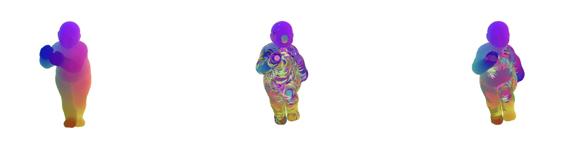

# Graph matching by PPMGM
Matlab code for the paper "Seeded graph matching for the correlated Gaussian Wigner model via the projected power method" by E.Araya, G.Braun and H.Tyagi. 

Contains the folders: Graph matching algorithms, Helpers, Synthetic data and Real data. 

Graph matching algorithms: code for the graph matching methods: grampa, umeyama, full_qp(convex relaxation to the Birkhoff polytope) and ppmgm.

Helpers: auxiliary methods, e.g, contains GMWM greedy algorithm (Alg.1 in the paper).

Synthetic data: code for reproducing Figs. 2,3,4,5 and 6. 

Real data: code for reproducing Figs. 7 and 8. 

